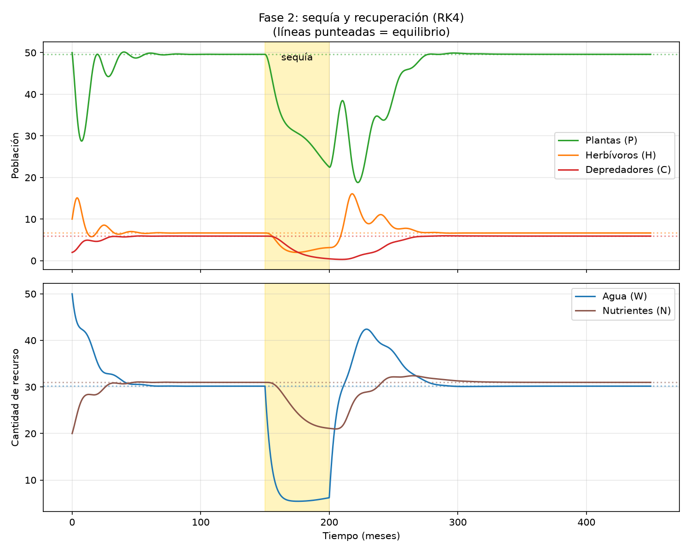
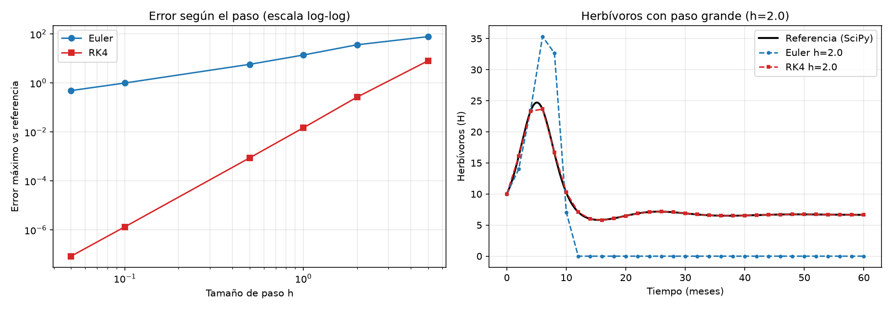
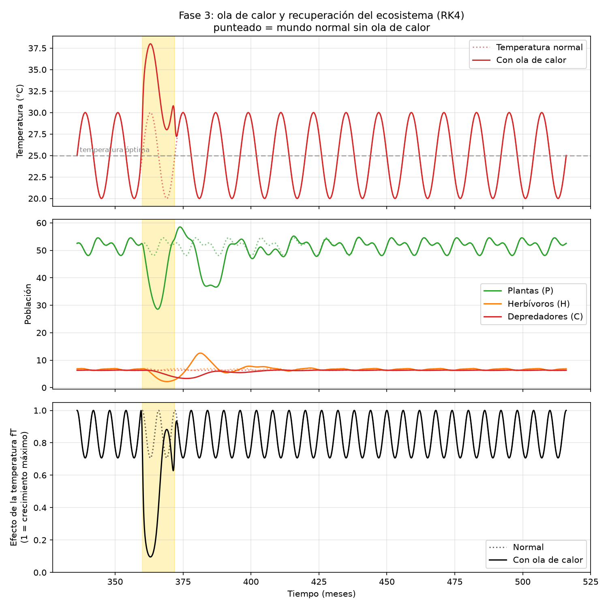
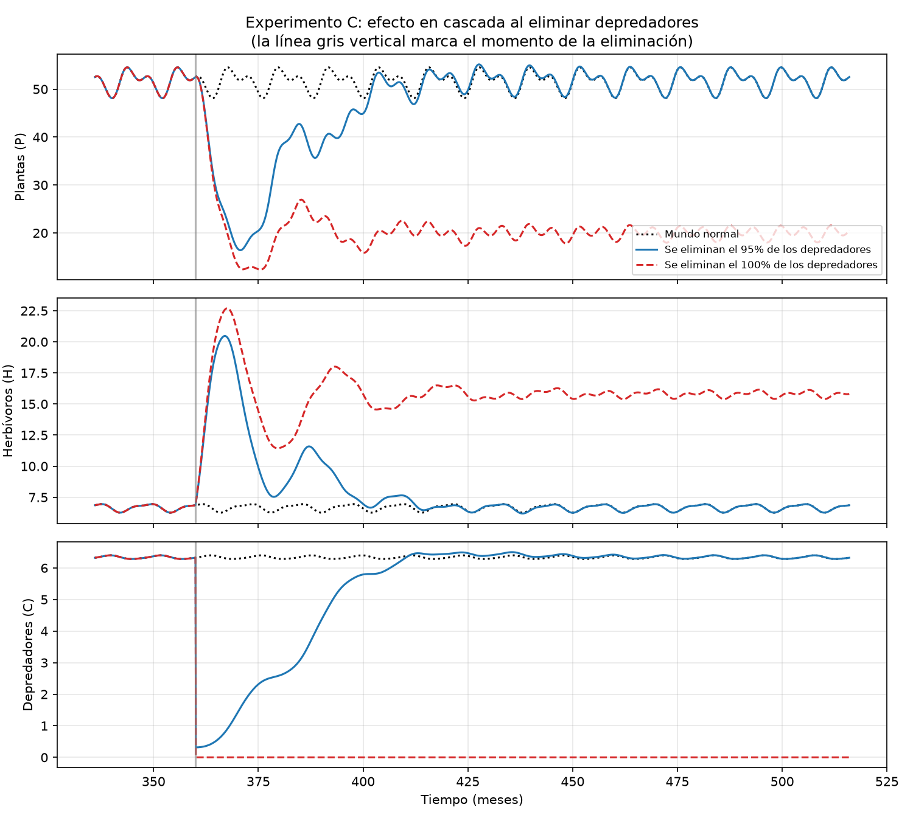
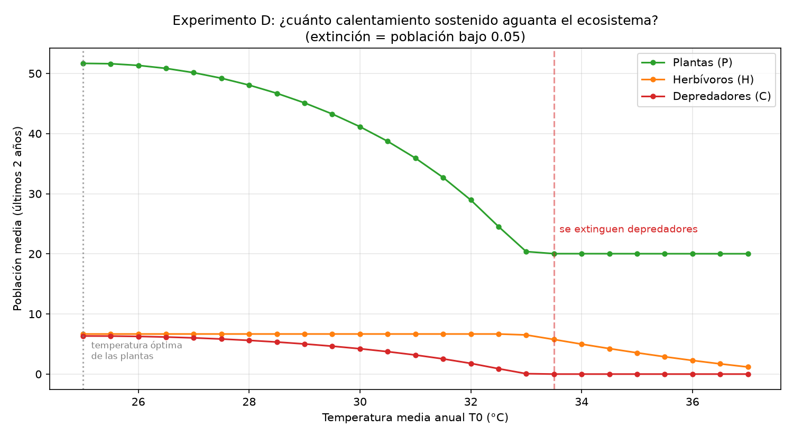
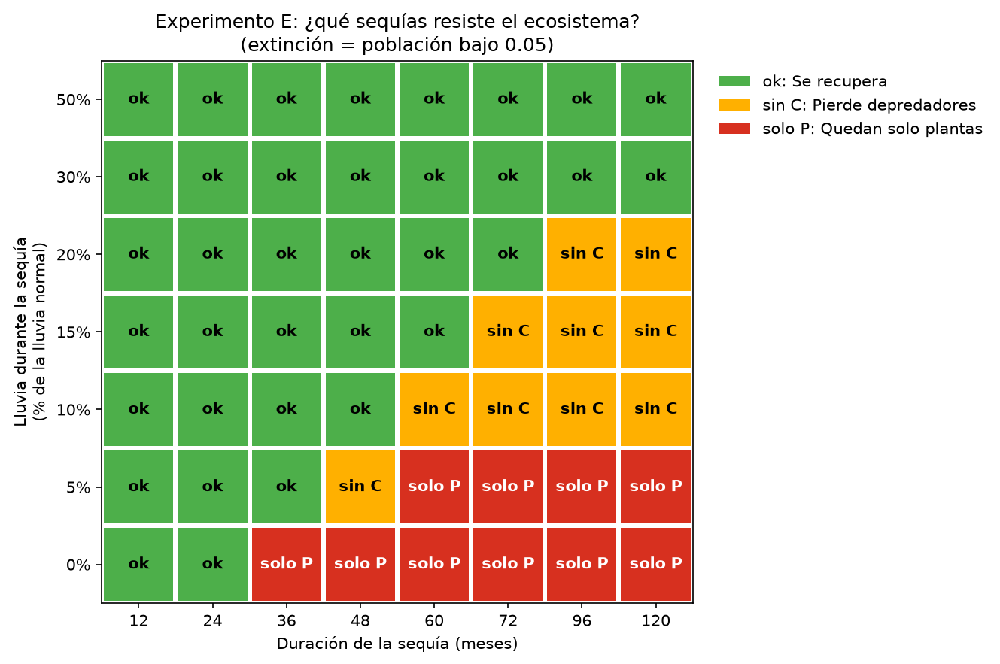
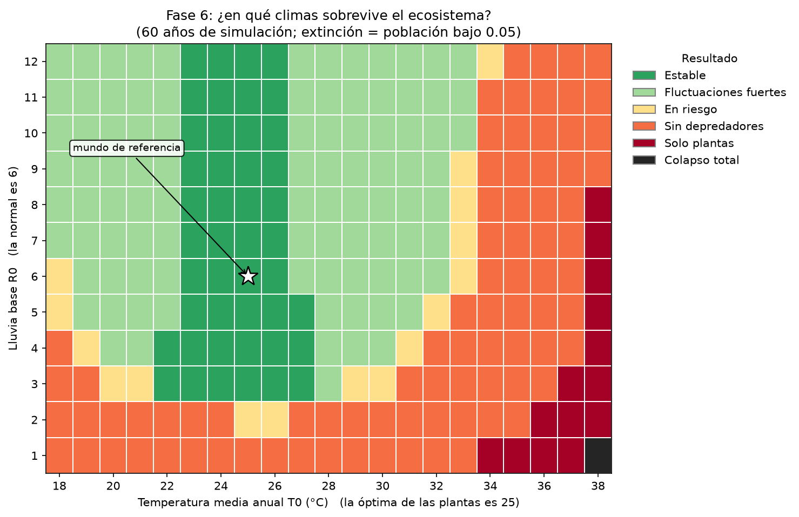
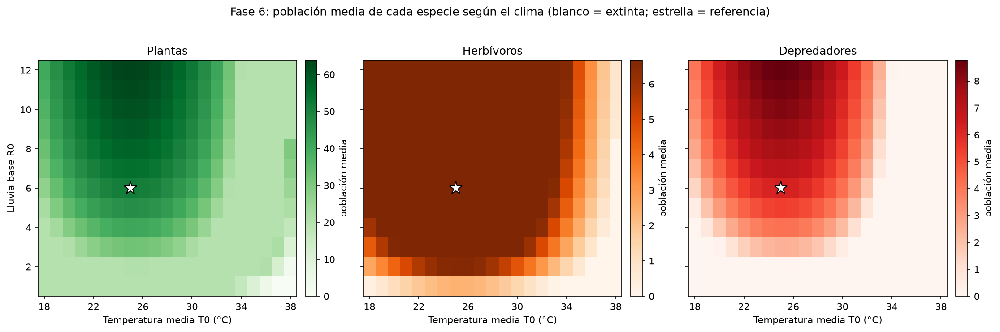

# Emergencia y estabilidad en un ecosistema artificial gobernado por ecuaciones diferenciales

*Modelado y simulación de un ecosistema artificial mediante un sistema de ecuaciones diferenciales no lineales.*

Proyecto presentado en la feria de la facultad. Todo el comportamiento del mundo (equilibrio, estaciones, sequías, extinciones, recuperación) **sale de las ecuaciones**: no hay eventos programados a mano. El programa solo resuelve el sistema numéricamente y muestra el resultado.



## La pregunta

> ¿Puede un sistema de ecuaciones diferenciales representar un ecosistema artificial capaz de presentar equilibrio, ciclos estacionales, extinciones y recuperación ante perturbaciones?

Y de ahí, preguntas concretas: ¿cuándo coexisten las especies? ¿qué pasa si falta agua, si suben las temperaturas o si desaparecen los depredadores? ¿cuánto tarda el ecosistema en recuperarse? ¿existe un punto de no retorno?

## El modelo

Cinco variables que dependen unas de otras:

| Variable | Representa |
| --- | --- |
| $P(t)$ | plantas |
| $H(t)$ | herbívoros |
| $C(t)$ | depredadores |
| $W(t)$ | agua disponible |
| $N(t)$ | nutrientes del suelo |

$$\frac{dP}{dt} = r_P\,P\left(1-\frac{P}{K_P}\right) f_W(W)\,f_N(N)\,f_T(T) - aPH - m_P P$$

$$\frac{dH}{dt} = e_H\,aPH - bHC - m_H H$$

$$\frac{dC}{dt} = e_C\,bHC - m_C C$$

$$\frac{dW}{dt} = R(t) - \lambda_W W - u_W P f_W(W)$$

$$\frac{dN}{dt} = S_N + \rho\left(aPH + bHC + m_P P + m_H H + m_C C\right) - u_N P f_N(N) - \lambda_N N$$

con las funciones de saturación y de clima:

$$f_W(W)=\frac{W}{K_W+W},\qquad f_N(N)=\frac{N}{K_N+N},\qquad f_T(T)=e^{-\frac{(T-T_{opt})^2}{2\sigma_T^2}}$$

$$T(t)=T_0+A_T\sin\left(\frac{2\pi t}{12}+\phi_T\right),\qquad R(t)=R_0\left[1+A_R\sin\left(\frac{2\pi t}{12}+\phi_R\right)\right]$$

El tiempo se mide en meses, así que el clima se repite cada 12.

**Qué es original y qué no.** No se inventan leyes ecológicas: se acoplan mecanismos clásicos (crecimiento logístico, depredación tipo Lotka-Volterra, saturación de recursos, reciclaje de nutrientes, temperatura óptima gaussiana) en un único sistema dinámico, y se estudia qué comportamiento emerge.

### Parámetros de referencia

| Grupo | Valores |
| --- | --- |
| Plantas | $r_P=1.0$ (0.8 en las fases 1 y 2), $K_P=100$, $m_P=0.05$ |
| Herbívoros | $a=0.02$, $e_H=0.5$, $m_H=0.2$ |
| Depredadores | $b=0.05$, $e_C=0.3$, $m_C=0.1$ |
| Recursos | $K_W=20$, $K_N=10$, $R_0=6$, $\lambda_W=0.1$, $u_W=0.1$, $S_N=1$, $\rho=0.1$, $u_N=0.02$, $\lambda_N=0.05$ |
| Clima | $T_0=25\,°C$, $A_T=5$, $T_{opt}=25\,°C$, $\sigma_T=6$, $A_R=0.6$, $\phi_R=-\pi/3$ |

Las unidades son arbitrarias: los valores se eligieron para obtener un ecosistema que coexista, no se midieron en un ecosistema real.

## Métodos numéricos

Se implementaron a mano, en [`src/solver.py`](src/solver.py), dos métodos para resolver el sistema:

- **Euler:** $y_{n+1}=y_n+h\,f(t_n,y_n)$
- **Runge-Kutta de orden 4 (RK4):** $y_{n+1}=y_n+\frac{h}{6}(k_1+2k_2+2k_3+k_4)$

Los resultados se contrastaron con `scipy.integrate.solve_ivp`. En el modelo mínimo (plantas, herbívoros y depredadores), con paso $h=1$ el error máximo de Euler es 13.8 y el de RK4 es 0.015; con $h=0.1$ son 1.0 y $1.3\times10^{-6}$. Con un paso grande ($h=2$), Euler incluso **extingue a los herbívoros por error del método**, algo que no ocurre en la solución real.



## Estructura del proyecto

```text
mundo-artificial-edo/
├── README.md
├── requirements.txt
├── src/
│   ├── modelo.py                  ecuaciones (fases 1, 2 y 3)
│   ├── solver.py                  Euler y RK4
│   ├── experimentos.py            utilidades: perturbaciones, extinción, recuperación
│   ├── fase1_minimo.py            P, H, C + comparación Euler/RK4
│   ├── fase2_recursos.py          agua, nutrientes y sequía
│   ├── fase3_clima.py             estaciones y ola de calor
│   ├── fase5_experimentos.py      sin depredadores y mapa de sequías
│   ├── fase5_calentamiento.py     calentamiento sostenido
│   ├── fase6_barrido.py           mapa lluvia x temperatura
│   ├── fase7_mundo.py             abre el mundo visual (Pygame)
│   └── mundo/                     el mundo visual, dividido por responsabilidades
│       ├── config.py              constantes: tamaños, colores, escalas
│       ├── escenarios.py          sequía, calor y extinción como funciones del tiempo
│       ├── simulacion.py          avanza las ecuaciones paso a paso (sin Pygame)
│       ├── entidades.py           plantas y animales que se mueven (sin Pygame)
│       ├── mundo.py               cantidad de seres según el modelo, capturas, nacimientos
│       ├── dibujo.py              dibuja el paisaje
│       ├── graficas.py            gráfica en vivo
│       ├── interfaz.py            botones y panel de datos
│       └── main.py                ventana y bucle principal
├── docs/                          capturas de pantalla
└── resultados/                    gráficas generadas por los scripts
```

## Cómo ejecutarlo

Se necesita Python 3.12 o similar.

```powershell
pip install -r requirements.txt
python src/fase1_minimo.py
python src/fase2_recursos.py
python src/fase3_clima.py
python src/fase5_experimentos.py
python src/fase5_calentamiento.py
python src/fase6_barrido.py
python src/fase7_mundo.py
```

Los scripts de las fases 1 a 6 solo necesitan numpy, scipy y matplotlib. El mundo visual (`fase7_mundo.py`) además necesita `pygame`, que ya está en `requirements.txt`.

Cada script imprime sus resultados en la terminal y guarda las gráficas en `resultados/`. Ejecútalos desde la carpeta principal del proyecto.

## Resultados

### Fase 1 y 2: equilibrio y sequía

Con los parámetros de referencia las cinco variables se estabilizan en un equilibrio (plantas ≈ 49.6, herbívoros ≈ 6.7, depredadores ≈ 5.9, agua ≈ 30.2, nutrientes ≈ 31.0), que coincide con el calculado directamente de las ecuaciones.

Con una **sequía** (lluvia al 20% durante 50 meses) aparece un efecto en cascada que nadie programó: baja el agua (−82%), luego las plantas (−62%), luego los herbívoros (−70%) y por último los depredadores (−95%, casi se extinguen). Al volver la lluvia, el ecosistema se recupera por completo en unos 69 meses.


### Fase 3: estaciones y ola de calor

Con lluvia y temperatura estacionales, el ecosistema entra en un **ciclo anual que se repite idéntico año tras año**. Una **ola de calor** de +8 °C durante 12 meses (la temperatura llega a 38 °C) reduce el efecto de la temperatura sobre el crecimiento de las plantas de 0.71 a 0.10, sin que nadie programe "matar plantas". Las plantas caen hasta un 45% respecto al mundo normal, los herbívoros un 67% y los depredadores un 48%; la recuperación tarda unos 36 meses.



### Fase 5: perturbaciones y puntos de no retorno

**Eliminar depredadores** produce una cascada trófica. Si se elimina el 95%, los herbívoros llegan a 3.2 veces lo normal, las plantas caen un 68% y todo se recupera en unos 53 meses. Si se eliminan **todos**, el ecosistema no colapsa pero se instala en otro estado: plantas en 20 (antes 52) y herbívoros en 15.8 (antes 6.7).



**Calentamiento sostenido:** con una temperatura media de unos 33.5 °C (8.5 °C sobre el óptimo de las plantas) los depredadores se extinguen; plantas y herbívoros sobreviven, muy mermados.



**Sequías de distinta severidad y duración:** hay un punto de no retorno. Con el 10% de la lluvia, el ecosistema aguanta hasta 48 meses y se recupera; a los 60 meses se extinguen los depredadores. Sin nada de lluvia, a partir de 36 meses solo quedan plantas, y eso ya no se revierte.



### Fase 6: ¿en qué climas sobrevive el ecosistema?

Barrido de 252 climas (12 valores de lluvia por 21 de temperatura, 60 años cada uno):



- Las tres especies coexisten de forma sólida (estable o con fuertes variaciones anuales) en el 55% del mapa. Con lluvia normal, entre 19 y 32 °C; con temperatura óptima, desde lluvia 3 en adelante.
- Los depredadores son la especie más frágil: "sin depredadores" es la segunda región más grande (33%).
- "Solo plantas" (6%) y "colapso total" (0.4%) aparecen solo en los extremos de calor y falta de agua.



### Fase 7: el mundo visual

`python src/fase7_mundo.py` abre una ventana donde el ecosistema se resuelve en tiempo real. Los botones aplican las perturbaciones de las fases anteriores:

| Tecla | Acción |
| --- | --- |
| `1` | Normal: termina la sequía o el calor que estén en curso |
| `2` | Sequía: la lluvia baja al 20% durante 50 meses |
| `3` | Ola de calor: +8 °C durante 12 meses |
| `4` | Extinción: se eliminan todos los depredadores |
| `R` | Reiniciar |
| `Espacio` | Pausa |
| `↑` `↓` | Más rápido o más lento |


Cómo se conecta el dibujo con las ecuaciones:

- **La cantidad de plantas, herbívoros y depredadores que se ven es la que da el modelo.** Los botones no tocan las poblaciones: solo cambian la lluvia o la temperatura que entran a las ecuaciones.
- **Las capturas y los nacimientos siguen las tasas de la ecuación de los herbívoros.** Un depredador solo captura a un herbívoro cuando lo alcanza y la tasa de depredación $bHC$ lo permite; los nacimientos siguen a $e_H a P H$. Sin depredadores no hay capturas.
- **Lo que se anima es una muestra.** En el mundo normal la ecuación pide muchas más capturas por segundo de las que se pueden mostrar; el dibujo anima algunas, pero los totales son los del modelo.
- El suelo se seca según el agua, el lago se encoge y el velo rojo aparece según la temperatura.

## Limitaciones

- **Parámetros ficticios.** Los valores no provienen de un ecosistema real; los resultados describen el comportamiento cualitativo del modelo.
- **Extinción.** En una ecuación diferencial una población nunca llega a cero y siempre puede recuperarse. Por eso se asume una población mínima viable (0.05): por debajo, la especie se considera extinta. Los resultados de extinción dependen de ese supuesto.
- **Sin ciclos propios.** En todo el rango estudiado las soluciones se repiten cada año; las "fluctuaciones fuertes" del mapa son los vaivenes estacionales, no oscilaciones propias de varios años ni caos.
- **Bordes aproximados.** En una comprobación con paso más fino y 125 años, 10 de 12 celdas del borde del mapa dieron la misma clase; las otras 2 eran especies "en riesgo" o casi extintas, que se asientan despacio. Los límites pueden correrse una celda.

## Estado del proyecto

- [x] Fase 1: modelo mínimo (plantas, herbívoros, depredadores)
- [x] Fase 2: agua y nutrientes
- [x] Fase 3: clima con estaciones
- [x] Fase 4: comparación Euler y RK4 (dentro de `fase1_minimo.py`)
- [x] Fase 5: experimentos de perturbación
- [x] Fase 6: barrido de parámetros
- [x] Fase 7: mundo visual interactivo (Pygame)
- [ ] Fase 8: demostración en vivo

## Autor

[@elmerToledo](https://github.com/elmerToledo)
